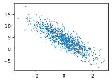

```python
import random
import torch
from d2l import torch as d2l
```


```python
#生成数据集
def synthetic_data(w, b, num_examples):
    X = torch.normal(0, 1, (num_examples, len(w)))
    y = torch.matmul(X, w) + b
    y += torch.normal(0, 0.01, y.shape)
    return X, y.reshape((-1, 1))
```


```python
true_w = torch.tensor([2, -3.4])
true_b = 4.2
features, labels = synthetic_data(true_w, true_b, 1000)
```


```python
print('features:', features[0],'\nlabel:', labels[0])
```

    features: tensor([-0.8611,  0.1771]) 
    label: tensor([1.8613])
    


```python
d2l.set_figsize()
d2l.plt.scatter(features[:, 1].detach().numpy(), labels.detach().numpy(), 1);
```


    

    


```python
#读取数据集
def data_iter(batch_size, features, labels):
    num_examples = len(features)
    indices = list(range(num_examples))
    for i in range(0, num_examples, batch_size):
        batch_indices = torch.tensor( indices[i: min(i + batch_size, num_examples)])
        yield features[batch_indices], labels[batch_indices]

```


```python
batch_size = 10

for X, y in data_iter(batch_size, features, labels):
    print(X, '\n', y)
    break
```

    tensor([[-8.6107e-01,  1.7708e-01],
            [-1.3659e+00,  9.4372e-02],
            [ 1.4794e-03,  3.7504e-01],
            [-1.3780e+00,  2.2642e+00],
            [ 2.5893e+00, -4.4938e-01],
            [-5.9420e-01,  1.8463e-01],
            [ 2.2947e-01,  1.1899e+00],
            [ 9.0952e-01,  1.7674e+00],
            [-5.0917e-01, -3.9882e-02],
            [-1.5366e+00,  5.0263e-01]]) 
     tensor([[ 1.8613e+00],
            [ 1.1518e+00],
            [ 2.9383e+00],
            [-6.2441e+00],
            [ 1.0892e+01],
            [ 2.3782e+00],
            [ 5.9521e-01],
            [ 4.6908e-03],
            [ 3.3124e+00],
            [-5.6925e-01]])
    


```python
#初始模型参数
w = torch.normal(0, 0.01, size=(2,1), requires_grad=True) 
b = torch.zeros(1, requires_grad=True)
```


```python
#定义模型
def linreg(X, w, b):
    return torch.matmul(X, w) + b
```


```python
#定义损失函数
def squared_loss(y_hat, y):
    return (y_hat - y.reshape(y_hat.shape)) ** 2 / 2
```


```python
#定义优化算法
def sgd(params, lr, batch_size):
    with torch.no_grad():
        for param in params:
            param -= lr * param.grad / batch_size
            param.grad.zero_()
```


```python
#训练
lr = 0.03
num_epochs = 3
net = linreg
loss = squared_loss
```


```python
for epoch in range(num_epochs):
    for X, y in data_iter(batch_size, features, labels):
        l = loss(net(X, w, b), y)
        l.sum().backward()
        sgd([w, b], lr, batch_size)
    with torch.no_grad():
        train_l = loss(net(features, w, b), labels)
        print(f'epoch {epoch + 1}, loss {float(train_l.mean()):f}')
```

    epoch 1, loss 0.047547
    epoch 2, loss 0.000189
    epoch 3, loss 0.000051
    


```python
print(f'w的估计误差: {true_w - w.reshape(true_w.shape)}')
print(f'b的估计误差: {true_b - b}')
```

    w的估计误差: tensor([ 0.0006, -0.0004], grad_fn=<SubBackward0>)
    b的估计误差: tensor([0.0005], grad_fn=<RsubBackward1>)
    
